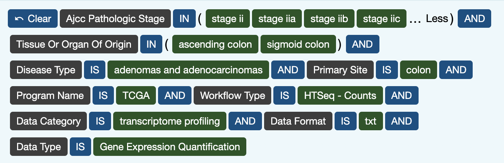

# Final Project Outline
## Title 
Differential Gene Expression in TCGA within Stage II Colon Adenocarcinomas comparing ascending colon and sigmoid colon tumor orgin sites using DeSEQ2

## Author 
Crystal Rubalcava

## Overview of Project 
We will identify differentially expressed genes between colon cancer adenocarcinoma patients with tumor sites originating in the ascending colon versus the sigmoid colon. Tumors found in the ascending colon are usually associated with right-sided colorectal (colon) cancer. Tumors found in the sigmoid colon are typically associated with left-sided colorectal (colon) cancer. This is important because  colorectal (colon) cancer does not contain a single type of tumor and origin site of the tumor can determine the molecular characteristics of the disease. To learn more about this difference, you can refer to the literature review here: [Difference Between Left-Sided and Right-Sided Colorectal Cancer: A Focused Review of Literature.](https://www.ncbi.nlm.nih.gov/pmc/articles/PMC6089587/)

This analysis will utilize the package DESeq2 and follow the specific vignette below for htseq-count files.

* Vignette:[http://bioconductor.org/packages/release/bioc/vignettes/DESeq2/inst/doc/DESeq2.html.](http://bioconductor.org/packages/release/bioc/vignettes/DESeq2/inst/doc/DESeq2.html) 

For this analysis, we'll use the TCGA cohort and have identified 85 ht-seq counts files for tumors that fit within my cohort with 36 cases of patients with tumor sites originating in the ascending colon and 33 cases of patients with tumor sites originating in the sigmoid colon. I will control for the stage of the cancer and the disease type. 

## Data
We will use the clinical data from [portal.gdc.cancer.gov/repository](https://portal.gdc.cancer.gov/repository.) From the data available for colon adenocarcinomas are in ```htseq.count``` files. There are 85 tumor samples where 36 had tumor origin sites in the ascending colon and 33 had cases in sigmoid colon.

Enter the following data into the GDC portal



#### Prepare the data for use in the DESeq Vignette 

* For the analysis of the data for stage II colon cancer patients, you can find the prepped data file here: < ADD CSV FILE TO A GOOGLE DRIVE AND SHARE THE LINK HERE>
* To learn how this data was prepped for use you can follow the steps shared in the following linux script:  < ADD LINK TO THE SCRIPTS FOR FILE ORGANIZING USING LINUX>
	* Skip to <add link to Known Issues> to learn about the known issues for using this approach.


## RNA-seq Data Analysis using DESeq2

Go to <link to DESeq2 Analysis> follow the reference DESeq2 vignette

The R Script for DESeq2 Analysis can be found here: <ADD HTML LINK FOR YOUR VIGNETTE>

### Differential Gene Expression Analysis

#### A. Build the sample DESeqDataSet

1) Using HTSeq counts as input use DESeqDataSetFromHTSeqCount to create a data frame sample table for all counts including tumor origin sites in the sigmoid (sig) and ascending colon(asc) and gender (M,F) for each case.

```{r}
library("stringr")
directory <- "~/final_project/allcounts/"
sampleFiles <- grep("counts",list.files(directory),value=TRUE)
#sampleCondition <- sub("^(\\d{3}).*$","\\1",sampleFiles) #if the code below does not work, use this to pull the first 3 letter of the file name to specify the condition
sampleCondition <- substr(sampleFiles, 0, 3) #first three letters of the file name contain the condition of the sample
sampleName <- substr(sampleFiles, 0, 5) #file name is the condition and number related to the file
sampleGender <- str_sub(sampleFiles, - 1, - 1) #last character of the file contains gender file sample
sampleTable <- data.frame(sampleName = sampleFiles,
                          fileName = sampleFiles,
                          condition = sampleCondition,
                          gender = sampleGender)
sampleTable$condition <- factor(sampleTable$condition)
```
* When you grep your sample files, use a common factor across all files, for this example we used ```counts```

sampleTable LINK

#### B. Build DESeqDataSet
```
directory <- "~/final_project/allcounts"
library("DESeq2")
ddsHTSeq <- DESeqDataSetFromHTSeqCount(sampleTable = sampleTable,
                                       directory = directory,
                                       design= ~ condition)
ddsHTSeq
```
1) Pre-filter low counts in data. In this case we consider low counts to be anything lower than 10 counts per gene. 

```
keep <- rowSums(counts(ddsHTSeq)) >= 10
dds <- ddsHTSeq[keep,]
```

2) Tell the DESeq2 functions which level you want to compare against. In this case, we will compare the tumor origin sites, sigmoid (sig) and ascending (asc) colon sites. The comparisons will be organized based on the alphabetical order of the levels. Here we explicitly explicitly set the factors levels. 

```
dds$condition <- factor(dds$condition, levels = c("sig","asc"))
```

3) We will subset the columns of a DESeqDataSet because we removed a few samples that contained less than or equal to 10 counts per gene. To do this, we use the droplevels function to remove those levels stated aboce which do not have samples in the current DESeqDataSet.

```
dds$condition <- droplevels(dds$condition)
```

#### C. Differential expression analysis begin using the DESeq function
1) The results tables are generated using the function results, which extracts a results table with log2 fold changes, p values and adjusted p values. The text, condition asc vs sig, tells you that the estimates are of the logarithmic fold change log2(asc/sig).

```
dds <- DESeq(dds)
res <- results(dds)
res
```

2)  Build the results table from the coefficients

```
res <- results(dds, name="condition_asc_vs_sig")
res <- results(dds, contrast=c("condition","sig","asc"))
```

3) Shrink the LFC estimates so that it is more useful for visualization and ranking of genes.

```
resultsNames(dds)
resLFC <- lfcShrink(dds, coef="condition_asc_vs_sig", type="apeglm")
resLFC
```

#### D. p-Values and adjusted p-Values
The results function contains a number of arguments to customize the results table which is generated. Note that the results function automatically performs independent filtering based on the mean of normalized counts for each gene, optimizing the number of genes which will have an adjusted p value below a given FDR cutoff, alpha. 

1) Reorder results table by the smallest p value and summarize the tallies.

```{r}
resOrdered <- res[order(res$pvalue),]
summary(res)
```
2) Find the total number of adjusted p-values that were less than 0.1

```
sum(res$padj < 0.1, na.rm=TRUE)
```
3) Below, we set alpha to 0.05. This means that if the adjusted p value cutoff will be a value other than 0.1, alpha should be set to that value.

```{r}
res05 <- results(dds, alpha=0.05)
summary(res05)
```

4) Find the total number of adjusted p-values that were less than 0.05

```{r}
sum(res05$padj < 0.05, na.rm=TRUE)
```

#### E.  Exploring and exporting results through plots and graphs

1) The function plotMA shows the log2 fold changes attributable to a given variable over the mean of normalized counts for all the samples in the DESeqDataSet. Points will be colored red if the adjusted p value is less than 0.1. Points which fall out of the window are plotted as open triangles pointing either up or down.

```{r}
plotMA(res, ylim=c(-2,2))

```

2) It is more useful visualize the MA-plot for the shrunken log2 fold changes, which remove the noise associated with log2 fold changes from low count genes without requiring arbitrary filtering thresholds.

```{r}
plotMA(resLFC, ylim=c(-2,2))

```
3) Alternative shrinkage estimators
The shrunken log fold changes are useful for ranking and visualization, without the need for arbitrary filters on low count genes. 

* The options for type are:

	* ```apeglm``` is the adaptive t prior shrinkage estimator from the apeglm package (Zhu, Ibrahim, and Love 2018). As of version 1.28.0, it is the default estimator.)

	* ```ashr``` is the adaptive shrinkage estimator from the ashr package (Stephens 2016). Here DESeq2 uses the ashr option to fit a mixture of Normal distributions to form the prior, with method="shrinkage".

	* ```normal``` is the the original DESeq2 shrinkage estimator, an adaptive Normal distribution as prior.

<LINK> 


#### F. Plot counts
1) Next, we examine the counts of reads for a single gene across the groups. The counts are grouped by the variables in intgroup, where more than one variable can be specified. You can call a specific gene to plot. Here we specify the gene which had the smallest p value from the results table created above.


```{r}
plotCounts(dds, gene=which.min(res$padj), intgroup="condition")

```
2) 
3) Exporting results to CSV files

```{r}
resSig <- subset(resOrdered, padj < 0.1)
resSig
write.csv(as.data.frame(resOrdered), 
          file="condition_sig_results.csv")

```

#### G. Multi-factor Design
1) Using two factors to analyze: tumor origin site(condition) and gender


```{r}
colData(dds)

```

```{r}
ddsMF <- dds
# There are only two levels in each factor so there is no need to edit the levels. If more simplicity is needed, go to DESeq vignette for more information on how to edit the levels. 
```

```{r}
design(ddsMF) <- formula(~ condition + gender)
ddsMF <- DESeq(ddsMF)
resMF <- results(ddsMF)
head(resMF)
```

```{r}
resMFCondition <- results(ddsMF,
                     contrast=c("condition", "asc", "sig"))
head(resMFType)
```

#### H. Data transformations and visualization

1) Prep the data for a blind disperstion estimation

```r}
vsd <- vst(dds, blind=FALSE)
head(assay(vsd), 3)
```

2) Plot the blind dispersion estimation

```{r}
meanSdPlot(assay(vsd))
```

3) Plot the data from a normal log transformation. 

* The figure below plots the standard deviation of the transformed data, across samples, against the mean, using the shifted logarithm transformation, the regularized log transformation and the variance stabilizing transformation. The shifted logarithm has elevated standard deviation in the lower count range, and the regularized log to a lesser extent, while for the variance stabilized data the standard deviation is roughly constant along the whole dynamic range.

```{r}
# this gives log2(n + 1)
ntd <- normTransform(dds)
library("vsn")
meanSdPlot(assay(ntd))
```

#### I.  Data quality assessment by sample clustering and visualization

1) Remove insufficiently good data - We start by plotting  a heatmap of the count matrix

```{r}
library("pheatmap")
select <- order(rowMeans(counts(dds,normalized=TRUE)),
                decreasing=TRUE)[1:20]
df <- as.data.frame(colData(dds)[,c("condition","gender")])
pheatmap(assay(ntd)[select,], cluster_rows=FALSE, show_rownames=FALSE,
         cluster_cols=FALSE, annotation_col=df)
```
```{r}
pheatmap(assay(vsd)[select,], cluster_rows=FALSE, show_rownames=FALSE,
         cluster_cols=FALSE, annotation_col=df)
```

2) Heatmap of the sample-to-sample distances

* In sample clustering, we apply the dist function to the transpose of the transformed count matrix to get sample-to-sample distances.


```
sampleDists <- dist(t(assay(vsd)))

library("RColorBrewer")
sampleDistMatrix <- as.matrix(sampleDists)
rownames(sampleDistMatrix) <- paste(vsd$condition, vsd$gender, sep="-")
colnames(sampleDistMatrix) <- NULL
colors <- colorRampPalette( rev(brewer.pal(9, "Blues")) )(255)
pheatmap(sampleDistMatrix,
         clustering_distance_rows=sampleDists,
         clustering_distance_cols=sampleDists,
         col=colors)
```

3) Principal component plot of the samples

* Use a PCA plot to visualize the overall effect of experimental covariates and batch effects.

```{r}
plotPCA(vsd, intgroup=c("condition", "gender"))
```
* Use ggplot2 to format the plot for simplified reads

```{r}
pcaData <- plotPCA(vsd, intgroup=c("condition", "gender"), returnData=TRUE)
percentVar <- round(100 * attr(pcaData, "percentVar"))
ggplot(pcaData, aes(PC1, PC2, color=condition, shape=gender)) +
  geom_point(size=3) +
  xlab(paste0("PC1: ",percentVar[1],"% variance")) +
  ylab(paste0("PC2: ",percentVar[2],"% variance")) + 
  coord_fixed()
```

#### J. Variations to the standard workflow 

1) Wald test individual steps

```{r}
dds <- estimateSizeFactors(dds)
dds <- estimateDispersions(dds)
dds <- nbinomWaldTest(dds)
```
2) Likelihood ratio test (LRT) -  determines if the increased likelihood of the data using the extra terms in the full model is more than expected if those extra terms are truly zero.

```{r}
dds <- DESeq(dds, test="LRT", reduced=~1)
res <- results(dds)
```

```{r}
resApeT <- lfcShrink(dds, coef=2, type="apeglm", lfcThreshold=1)
plotMA(resApeT, ylim=c(-3,3), cex=.8)
abline(h=c(-1,1), col="dodgerblue", lwd=2)
```

#### K. Single Cell Analysis

* While the negative binomial is versatile in having a mean and dispersion parameter, extreme counts in individual samples might not fit well to the negative binomial. For this reason, we perform automatic detection of count outliers. We use Cook’s distance, which is a measure of how much the fitted coefficients would change if an individual sample were removed (Cook 1977).

1) Check count outliers

```{r}
par(mar=c(8,5,2,2))
boxplot(log10(assays(dds)[["cooks"]]), range=0, las=2)
head(boxplot())
```
```{r}
W <- res$stat
maxCooks <- apply(assays(dds)[["cooks"]],1,max)
idx <- !is.na(W)
plot(rank(W[idx]), maxCooks[idx], xlab="rank of Wald statistic", 
     ylab="maximum Cook's distance per gene",
     ylim=c(0,5), cex=.4, col=rgb(0,0,0,.3))
m <- ncol(dds)
p <- 3
abline(h=qf(.99, p, m - p))
```


## Known Issues

### Change ENSEMBL ID to HUGO ID 
* Attempted to change ENSEMBL ID to HUGO ID using the script for this can be found here: <ADD LINK TO ENSEMBL ID to HUGO ID change>
* I did not successfully convert the ENS IDs - I will need to revisit this step and update accordingly. 


###  Renaming files manually 
* To change the file names, I had to manually remove the extra name file to simplify the file names from condition_LONG FILE NAME.htseq.counts to condition_seq.counts files. I attempted to use the bash script```$ sed 's/[_].[.].*//'``` to remove the LONG FILE NAME but was unsuccessful.

### Create Sample Table
* When creating the sample table, I used ```substr(sampleFiles, 0, 3)``` to pull the condition from the first three letters of the file name. I attempted to use ```sub("^(\\d{3}).*$","\\1",sampleFiles)``` but was this created an error. 

### Tumor origin site analysis
* There wasn't enough factors to test against the tumor origin site so I cannot confidently come to any conclusions from the gene analysis of this factor. I attempted to check the compare the progression of stage ii colon cancer (ii, iia, iib, iic) however this data was not available for all cases. Instead, I opted for gender factor, M vs F to analyze with tumor origin site (seen as condition in the script). 


